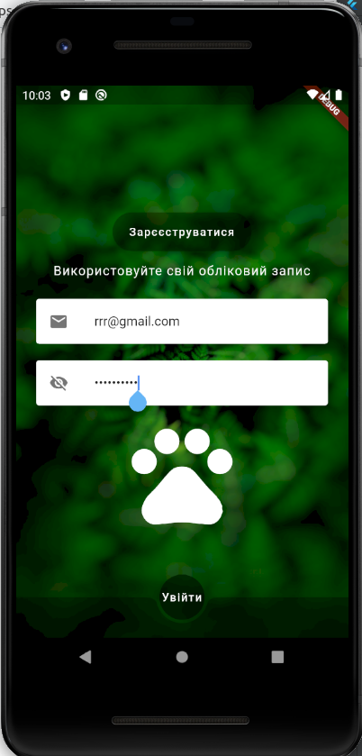
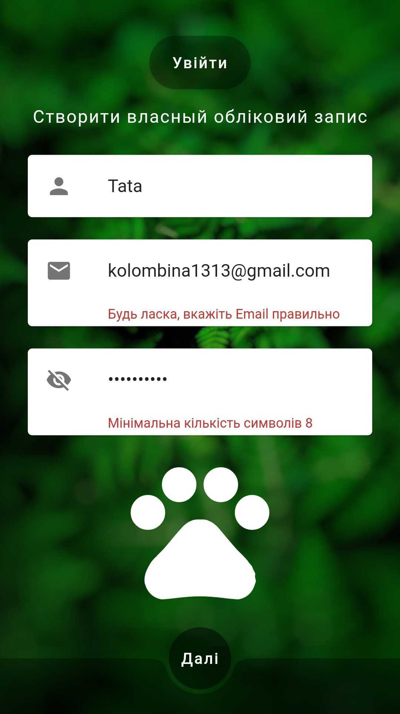
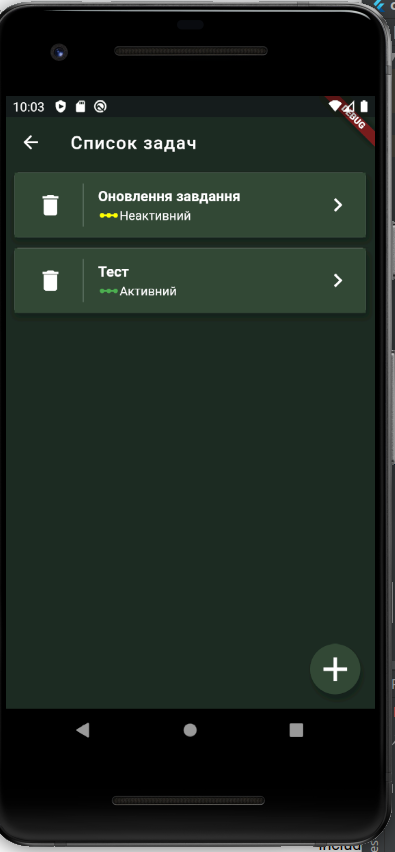
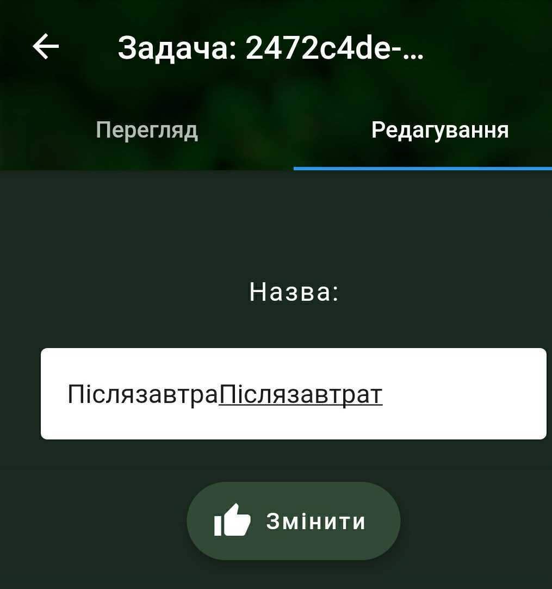
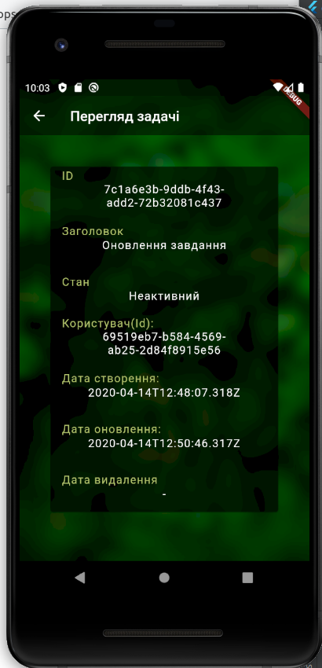

# CAT

Create A Task

~~~~

Опціонально: з валідацією полів

Робота авторизації та реєстрації через REST API
Отримання списку завдань через REST API по token

Додавання/редагування завдання через REST API
Зміна стану завдання через REST API (Активний→Виконаний→Активний→Виконаний→Видалений)
~~~~

Створено екрани:

Авторизація (поля: Email, Пароль)

Реєстрація (поля: Iмʼя, Email, Пароль)

Список завдань

Додавання/редагування завдання (з одним полем “Назва”)

Перегляд завдання

